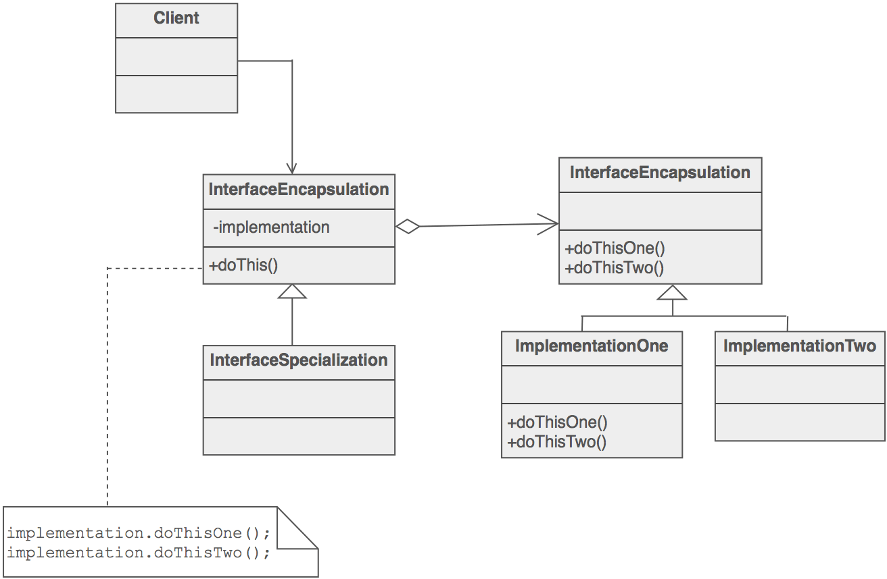

# O Padrão de Bridge Pattern

O padrão [Bridge](https://sourcemaking.com/design_patterns/bridge) é um [padrão estrutural](https://sourcemaking.com/design_patterns/structural_patterns) que é utilizado em situações onde queremos separar a abstração da implementação do código.

Neste padrão existe uma **dependência do cliente relativamente à interface** que permite o acesso a implementações de objetos criados dinamicamente durante a execução da aplicação. Desta forma é possível **criar novas implementações sem alterar a estrutura de dependências**.

O cliente interage sempre com o objeto que representa a interface com as implementações, que por sua vez delega os pedidos para o objeto pertencente à classe que contém a implementação. Desta forma, a implementação pode ser acrescentada em runtime, sem recompilar a aplicação. A imagem seguinte mostra a estrutura abstrata do padrão.

## Exercicio

Aplique o padrão Bridge a um componente que permita o acesso a vários serviços instanciados dinamicamente para armazenar e obter conteúdos.

A classe que serve de interface deve fornecer:

- os **métodos gerais** presentes na especificação

- uma **especialização do método** _getContent_ que permita obter todo o conteúdo agregado de um serviço.

Como o conteúdo está armazenado num _hashmap_, a classe _LinkedHashMap_ tem de ser utilizada em vez da classe _HashMap_ tradicional, para garantir que os dados sejam acedidos iterativamente pela ordem de inserção.
