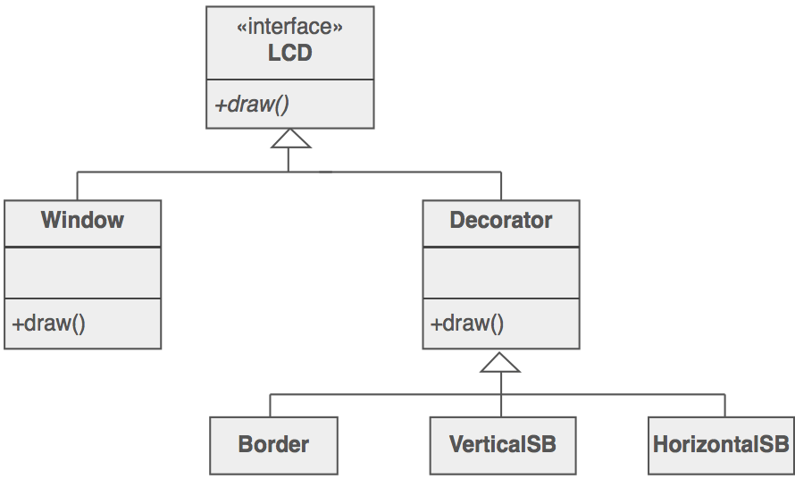

# O Padrão de Desenho Decorator

O padrão [Decorator](https://sourcemaking.com/design_patterns/decorator) é um [padrão estrutural](https://sourcemaking.com/design_patterns/structural_patterns) que permite **adicionar novas responsabilidades (comportamento/estado)** aos **objetos em runtime**. Desta forma, a construção das características de um objeto solicitada pelo cliente dinamicamente.

Este padrão fornece uma alternativa à herança para estender a funcionalidade de uma classe. Para exemplificar o conceito, considere o diagrama seguinte.



No diagrama anterior, a classe _Window_ representa o objeto principal do padrão, enquanto que a classe _Decorator_ e derivadas representam a lógica adicional que pode ser adicionada ao objeto principal dinamicamente. Para exemplificar, o código seguinte adiciona os elementos necessários para criar uma estrutura composta pelo objeto principal _Window_ e outros objetos utilizados para fazer a decoração de uma janela (_scrollbar_ vertical, _scrollbar_ horizontal e _border_).

```java
Widget aWidget = new Border(new HorizontalSB(new VerticalSB( new Window( 80, 24 ))));
aWidget.draw();
```

## Exercicio

Aplique o padrão Decorator a um componente responsável por fazer a **autenticação de um serviço**. Este componente deverá permitir **decorar a funcionalidade principal** com funcionalidades de:

- **Logging**
- **Verificação de palavras inseguras na password**, recorrendo a uma API REST que permite verificar se a palavra utilizada durante o processo de autenticação é insegura (faz parte do dicionário).
