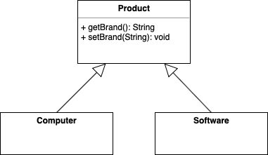

# O Padrão de Desenho Factory Method

A arquitetura de muitos frameworks abriga à definição de uma **interface comum para a criação de objetos**, sem comprometer as especificidades de cada objeto.

O padrão [Factory Method](https://sourcemaking.com/design_patterns/factory_method) permite definir uma interface para a criação desses objetos. Neste padrão, a _superclasse_ **do objeto a criar implementa o comportamento genérico**, enquanto que as _subclasses_ **instanciadas pelos clientes implementam os detalhes da criação**.

O desenho dos **argumentos do método da fábrica** utilizada para criar o objeto permite a **identificação da classe derivada a instanciar**. Para evitar várias formas de instanciação, os **construtores não podem ser públicos** e o **método da fábrica deve ser** _static_.

Este padrão pode ser complementado com uma [object pool](../objectpool) para reutilizar objetos. Desta forma objetos com o mesmo estado podem ser reutilizados.

## Exercicio

Aplique o padrão Factory Method à criação dos objetos **Computer** e **Software**.
