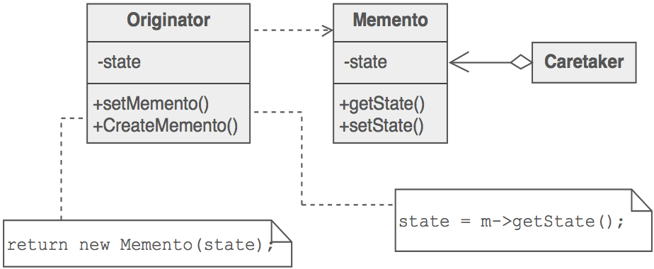

# O Padrão de Desenho Memento

O padrão [Memento](https://sourcemaking.com/design_patterns/memento) é um [padrão comportamental](https://sourcemaking.com/design_patterns/behavioral_patterns) utilizado quando o **estado do objeto** necessita de ser **guardado fora do mesmo**, de forma a restaurar esse estado posteriormente. Este padrão é utilizado em situações em que é necessário fazer **_rollback/undo_** do estado do objeto ou proteger esse estado de uma forma independente do objeto que o gerou.

No diagrama anterior

- o **Originator** é o objeto que **cria e interpreta os estados** armazenados em objetos Memento

- o **Caretaker** solicita a criação de objetos _Memento_ e **armazena os objetos** até serem necessários novamente, **mas não tem acesso ao estado do mesmo**.

## Exercicio

Aplique o padrão _Memento_ a um serviço de backups que permite guardar _snapshots_ do estado de um servidor responsável por registar o nome de estudantes.
