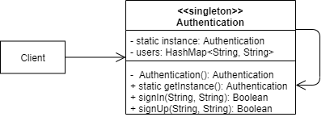
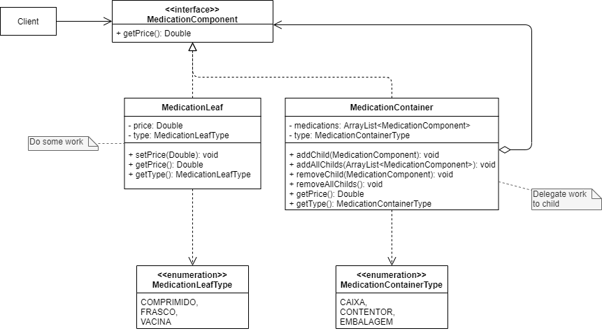
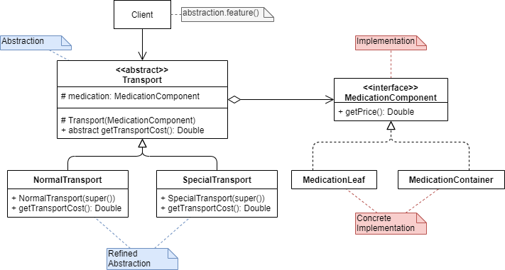
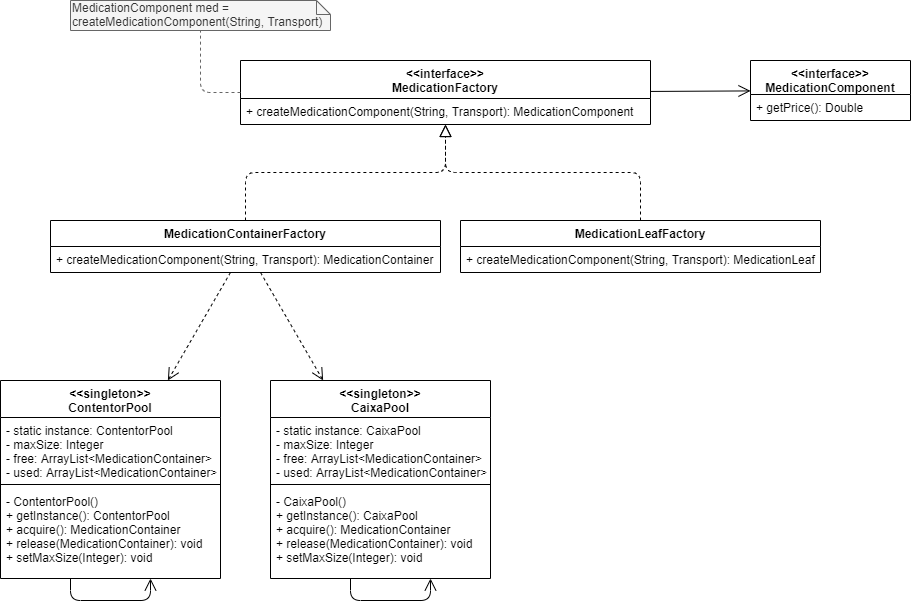

# Pratical Work

Contém o resultado da minha resolução do trabalho prático.

## [Assignment](./Assignment.pdf)

1. **A autenticação dos motoristas deverá ser implementada num objeto global com o username e password dos condutores.**

   _Solution:_

2. **Os medicamentos a transportar poderão estar agrupados por níveis. O motorista pode transportar contentores ou caixas contendo embalagens de medicamentos.**

   _Solution:_

3. **O custo de transporte deve ser calculado como uma percentagem do somatório do preço das embalagens de medicamentos transportados, de duas formas distintas:**

   - **5% do valor dos medicamentos durante períodos normais.**

   - **10% do valor dos medicamentos durante períodos especiais.**

   **A aplicação deverá estar preparada para aceitar novos esquemas de cobrança.**

   _Solution:_

4. **As caixas e os contentores poderão ser reutilizados, pelo que, durante o processo de criação dos objetos pertencentes a um destes tipos, deverá ser dada a possibilidade de reutilizar um objeto já existente.**

   _Solution:_

