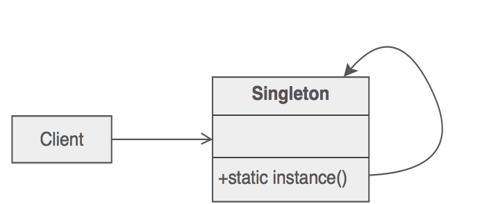

# O Padrão de Desenho Singleton

O [Singleton](https://sourcemaking.com/design_patterns/singleton) é um **padrão de criação**, uma vez que condiciona a forma como um objeto é criado. Este padrão obriga à criação de uma **única instância de um objeto** na aplicação, quando ele for **necessário pela primeira vez** ([lazy instantiation](https://en.wikipedia.org/wiki/Lazy_initialization)).

A classe Singleton é responsável pela criação do objeto (static), enquanto que os **clientes dessa classe chamam um método assessor para aceder à instância do objecto**. Desta forma, nenhum objeto adquire a posse do objeto Singleton.

## Exercicio

Muitas vezes as aplicações necessitam de uma estrutura global que permita o registo de variáveis transversais a toda a aplicação. Essas variáveis têm de ser registadas num objeto único, cuja criação deve ser feita de uma forma centralizada e controlada, de forma a evitar a criação de várias instâncias dessa classe.

Pretende-se neste exercício aplicar o padrão [Singleton](https://sourcemaking.com/design_patterns/singleton) a uma estrutura global da aplicação responsável por fazer o registo da _path_ para a pasta onde a aplicação vai guardar os ficheiros e a _connection string_ para a base de dados.
